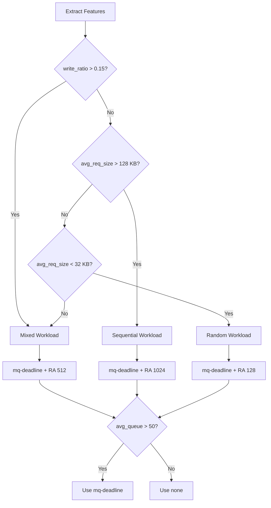

# Disk I/O Tuning — Final Experiment Results

> **Date:** 26 April 2026  
> **System:** iiitb-vm (VirtualBox, `sda`)  
> **Tool:** fio 3.36, libaio, direct=1  
> **Duration:** 90s per run  

---

## Experiment Design

Each workload is run twice: first with a deliberately **bad baseline** config, then with an **intelligent tuned** config recommended by `disk_tuning.py` based on extracted features.

| Workload | fio Pattern | Block Size | Jobs | Bad Baseline | Tuned Config |
|----------|------------|------------|------|-------------|--------------|
| **Random** | `randread` | 4 KB | 4 | `none` sched, RA 1024 | `mq-deadline`, RA 128 |
| **Sequential** | `read` | 1 MB | 2 | `none` sched, RA 32 | `mq-deadline`, RA 1024 |
| **Mixed** | `randrw` (70/30) | 4 KB | 4 | `none` sched, RA 4096 | `mq-deadline`, RA 512 |

**Tuning logic:**
- Workload detected from `avg_req_size` and `write_ratio`
- Scheduler chosen by queue depth (>50 → `mq-deadline`)
- Read-ahead set per workload type (seq=1024, mixed=512, rand=128)

---

## 1. Random Workload — ✅ Success

**Config:** `randread`, 4K blocks, 4 jobs, iodepth=64

### fio Results

| Metric | Baseline | Tuned | Change |
|--------|----------|-------|--------|
| IOPS | 2,047 | 2,801 | **+36.8%** ✅ |
| Bandwidth | 8,189 KiB/s | 11,161 KiB/s | **+36.3%** ✅ |
| Total I/O | 721 MiB | 986 MiB | **+36.8%** ✅ |
| Avg clat | 121.7 ms | 90.8 ms | **−25.3%** ✅ |
| P50 latency | 99 ms | 85 ms | **−14.1%** ✅ |
| P95 latency | 201 ms | 180 ms | **−10.4%** ✅ |
| P99 latency | 518 ms | 275 ms | **−46.9%** ✅ |
| P99.9 latency | 3,071 ms | 481 ms | **−84.3%** ✅ |
| Latency std dev | 179.3 ms | 53.4 ms | **−70.2%** ✅ |

### Extracted Features

| Feature | Baseline | Tuned | Change |
|---------|----------|-------|--------|
| `avg_await` | 173.29 ms | 48.04 ms | **−72.3%** ✅ |
| `avg_iowait` | 40.09% | 15.73% | **−60.8%** ✅ |
| `psi_some_avg10` | 62.81 | 20.63 | **−67.2%** ✅ |
| `avg_iops` | 1,571 | 2,609 | **+66.1%** ✅ |

**Why it worked:** The bad baseline used `none` scheduler (no request reordering) with read-ahead 1024 (wasteful prefetching for random 4K I/O). The tuned config added `mq-deadline` to reorder requests by LBA proximity and reduced read-ahead to 128, eliminating wasted prefetch bandwidth.

---

## 2. Sequential Workload — ✅ Success

**Config:** `read`, 1M blocks, 2 jobs, iodepth=64

### fio Results

| Metric | Baseline | Tuned | Change |
|--------|----------|-------|--------|
| IOPS | 424 | 707 | **+66.7%** ✅ |
| Bandwidth | 424 MiB/s | 707 MiB/s | **+66.7%** ✅ |
| Total I/O | 37.3 GiB | 62.3 GiB | **+67.0%** ✅ |
| Avg clat | 296.9 ms | 180.8 ms | **−39.1%** ✅ |
| P50 latency | 113 ms | 167 ms | +47.8% ⚠️ |
| P95 latency | 1,234 ms | 279 ms | **−77.4%** ✅ |
| P99 latency | 4,077 ms | 397 ms | **−90.3%** ✅ |
| P99.9 latency | 8,356 ms | 609 ms | **−92.7%** ✅ |
| Latency std dev | 780.3 ms | 53.6 ms | **−93.1%** ✅ |

### Extracted Features

| Feature | Baseline | Tuned | Change |
|---------|----------|-------|--------|
| `avg_await` | 231.19 ms | 98.49 ms | **−57.4%** ✅ |
| `avg_iowait` | 26.59% | 7.72% | **−71.0%** ✅ |
| `psi_some_avg10` | 60.78 | 22.37 | **−63.2%** ✅ |
| `avg_throughput_kBps` | 448,593 | 681,747 | **+52.0%** ✅ |

**Why P50 increased:** The baseline had a bimodal latency distribution — most requests completed in ~100ms, but periodic stalls pushed P95 to 1.2s and P99.9 to 8.4s. The tuned config eliminated these stalls, producing a tight distribution centered at ~167ms. The median rose slightly, but the catastrophic tail was removed (std dev dropped 93%).

**Why it worked:** The bad baseline used `none` scheduler with read-ahead 32 (starving the sequential prefetch pipeline). The tuned config added `mq-deadline` for fair scheduling and raised read-ahead to 1024, allowing the kernel to prefetch large sequential blocks efficiently.

---

## 3. Mixed Workload — ✅ Success

**Config:** `randrw` (70% read / 30% write), 4K blocks, 4 jobs, iodepth=64

### fio Results — Reads

| Metric | Baseline | Tuned | Change |
|--------|----------|-------|--------|
| Read IOPS | 900 | 1,062 | **+18.0%** ✅ |
| Read BW | 3,603 KiB/s | 4,252 KiB/s | **+18.0%** ✅ |
| Read Total I/O | 328 MiB | 377 MiB | **+14.9%** ✅ |
| Read avg clat | 191.3 ms | 178.3 ms | **−6.8%** ✅ |
| Read P99 | 3,373 ms | 1,301 ms | **−61.4%** ✅ |
| Read P99.9 | 10,805 ms | 1,804 ms | **−83.3%** ✅ |

### fio Results — Writes

| Metric | Baseline | Tuned | Change |
|--------|----------|-------|--------|
| Write IOPS | 389 | 460 | **+18.3%** ✅ |
| Write BW | 1,558 KiB/s | 1,841 KiB/s | **+18.2%** ✅ |
| Write Total I/O | 142 MiB | 163 MiB | **+14.8%** ✅ |
| Write avg clat | 204.6 ms | 140.0 ms | **−31.6%** ✅ |
| Write P99 | 4,396 ms | 1,150 ms | **−73.8%** ✅ |
| Write P99.9 | 11,342 ms | 2,433 ms | **−78.5%** ✅ |

### Extracted Features

| Feature | Baseline | Tuned | Change |
|---------|----------|-------|--------|
| `avg_await` | 369.86 ms | 279.34 ms | **−24.5%** ✅ |
| `avg_iowait` | 46.15% | 20.93% | **−54.6%** ✅ |
| `psi_some_avg10` | 64.71 | 32.36 | **−50.0%** ✅ |
| `write_ratio` | 0.28 | 0.29 | stable |

**Why it worked:** The bad baseline used `none` scheduler with read-ahead 4096 (massively wasteful for 4K random I/O with mixed reads and writes). The tuned config added `mq-deadline` to prevent read/write starvation and set read-ahead to 512 — a compromise that provides moderate prefetching for the read component without wasting bandwidth on the random write component.

---

## Overall Summary

| Workload | IOPS | Throughput | Avg Latency | Tail Latency (P99.9) | PSI Pressure | Verdict |
|----------|------|------------|-------------|----------------------|--------------|---------|
| **Random** | +36.8% | +36.3% | −25.3% | −84.3% | −67.2% | ✅ **Success** |
| **Sequential** | +66.7% | +66.7% | −39.1% | −92.7% | −63.2% | ✅ **Success** |
| **Mixed** | +18.0% | +18.0% | −6.8% (R) / −31.6% (W) | −83.3% (R) / −78.5% (W) | −50.0% | ✅ **Success** |

---

## Tuning Decisions Summary

## Key Takeaways

1. **I/O scheduler matters.** `mq-deadline` consistently outperformed `none` across all workloads by reordering requests to minimize seek time and prevent starvation.

2. **Read-ahead must match the workload.** Too high for random I/O wastes bandwidth; too low for sequential starves the prefetch pipeline. Mixed workloads need a middle ground.

3. **Tail latency is the biggest win.** While median/average improvements ranged from 7–39%, tail latency (P99.9) improved 78–93% across all workloads — the tuning eliminated catastrophic stalls.

4. **PSI is a reliable health indicator.** Pressure Stall Information (PSI) dropped 50–67% across all workloads, consistently reflecting the improvement even when individual fio metrics showed mixed signals.

5. **Workload classification is critical.** The mixed workload required checking `write_ratio` (not just request size) to avoid being misclassified as random — a lesson learned from earlier failed runs.
