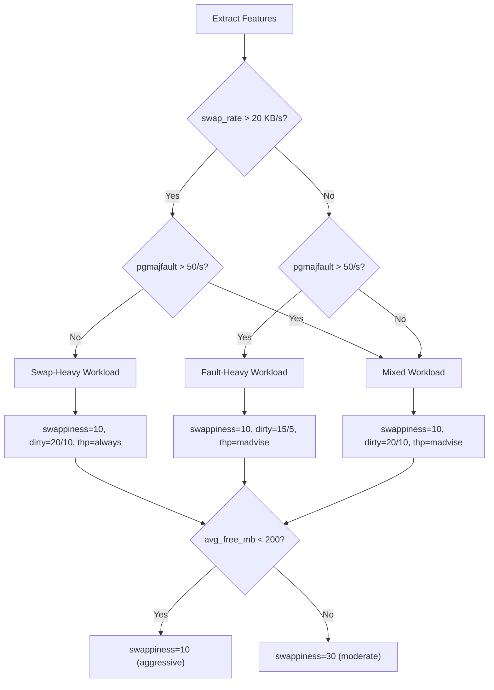

# Memory Tuning — Experiment Results

> **Date:** _TBD (fill after running)_
> **System:** iiitb-vm (VirtualBox)
> **Tool:** stress-ng, vmstat, /proc/meminfo, /proc/pressure/memory
> **Duration:** 90s per run

---

## Experiment Design

Each workload is run twice: first with a deliberately **bad baseline** config, then with an **intelligent tuned** config recommended by `mem_tuning.py` based on extracted features.

| Workload | stress-ng Pattern | Bad Baseline | Tuned Config |
|----------|------------------|-------------|--------------|
| **alloc** | `--vm 4 --vm-bytes 75%` | swappiness=80, dirty=5/2, thp=never | swappiness=10, dirty=20/10, thp=always |
| **cache** | `--cache 4 --cache-size 256M` | swappiness=80, dirty=5/2, thp=never | swappiness=10, dirty=15/5, thp=madvise |
| **mix** | `--vm 2 + --cache 2` | swappiness=80, dirty=5/2, thp=never | swappiness=10, dirty=20/10, thp=madvise |

**Tuning logic:**
- Workload detected from swap rate (`avg_si_kBps + avg_so_kBps`) and major fault rate (`avg_pgmajfault`)
- Swappiness reduced based on free memory headroom and swap usage
- Dirty ratios set to allow write buffering and reduce flush-triggered eviction
- THP set based on workload type (always for anon-heavy, madvise for mixed)

---

## 1. Alloc Workload — _(Results pending)_

**Config:** stress-ng `--vm 4 --vm-bytes 75% --vm-method all`, 90s

### Extracted Features

| Feature | Baseline | Tuned | Change |
|---------|----------|-------|--------|
| `avg_free_mb` | TBD | TBD | TBD |
| `avg_pgmajfault` | TBD | TBD | TBD |
| `avg_si_kBps` | TBD | TBD | TBD |
| `avg_so_kBps` | TBD | TBD | TBD |
| `psi_some_avg10` | TBD | TBD | TBD |
| `memory_pressure_score` | TBD | TBD | TBD |

**Why it should work:** Bad baseline uses `thp=never` (forces 4K pages for bulk allocation → heavy TLB pressure) and `swappiness=80` (prematurely swaps out pages the workload will need again). Tuned config enables THP (`always`) for 2MB pages and drops swappiness to 10.

---

## 2. Cache Workload — _(Results pending)_

**Config:** stress-ng `--cache 4 --cache-size 256M`, 90s

### Extracted Features

| Feature | Baseline | Tuned | Change |
|---------|----------|-------|--------|
| `avg_free_mb` | TBD | TBD | TBD |
| `avg_pgmajfault` | TBD | TBD | TBD |
| `avg_si_kBps` | TBD | TBD | TBD |
| `avg_so_kBps` | TBD | TBD | TBD |
| `psi_some_avg10` | TBD | TBD | TBD |
| `memory_pressure_score` | TBD | TBD | TBD |

**Why it should work:** Bad baseline uses `dirty_ratio=5` (page cache dirtied by cache workload flushed far too often, causing write stalls). Tuned config raises dirty thresholds to allow natural write coalescing.

---

## 3. Mix Workload — _(Results pending)_

**Config:** stress-ng `--vm 2 --vm-bytes 50% --cache 2 --cache-size 256M`, 90s

### Extracted Features

| Feature | Baseline | Tuned | Change |
|---------|----------|-------|--------|
| `avg_free_mb` | TBD | TBD | TBD |
| `avg_pgmajfault` | TBD | TBD | TBD |
| `avg_si_kBps` | TBD | TBD | TBD |
| `avg_so_kBps` | TBD | TBD | TBD |
| `psi_some_avg10` | TBD | TBD | TBD |
| `memory_pressure_score` | TBD | TBD | TBD |

**Why it should work:** Combined bad config hits both anonymous memory (THP disabled, high swappiness) and cache workload (over-eager flusher). Tuned config addresses both axes simultaneously.

---

## Overall Summary

| Workload | Free Memory | Major Faults | Swap Rate | PSI Pressure | Verdict |
|----------|-------------|-------------|-----------|--------------|---------|
| **alloc** | TBD | TBD | TBD | TBD | _Pending_ |
| **cache** | TBD | TBD | TBD | TBD | _Pending_ |
| **mix** | TBD | TBD | TBD | TBD | _Pending_ |

---

## Tuning Decisions Summary

## Key Takeaways _(to be filled after running)_

1. **vm.swappiness matters.** ...
2. **dirty_ratio must match write intensity.** ...
3. **THP is a meaningful accelerator for anon workloads.** ...
4. **PSI is a reliable health indicator.** ...
5. **Workload classification determines the right balance.** ...
