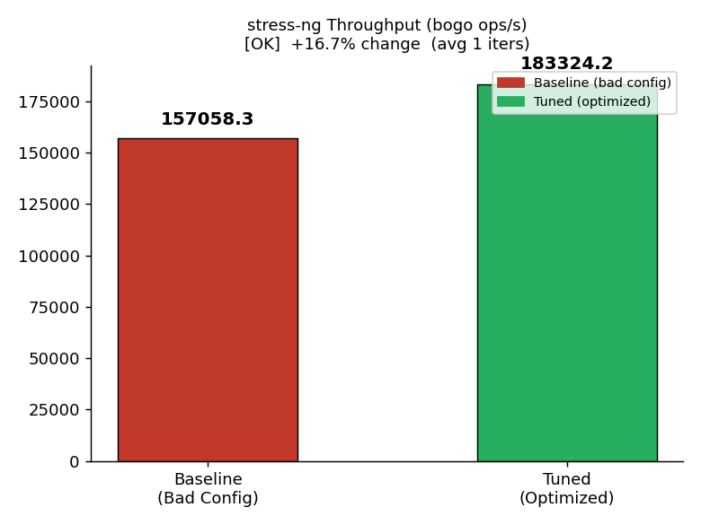
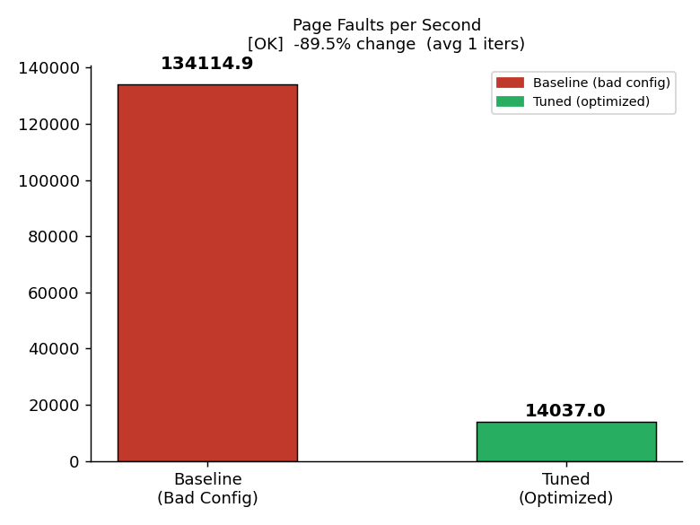
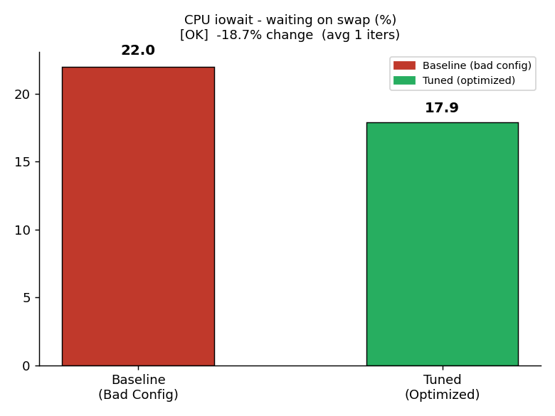
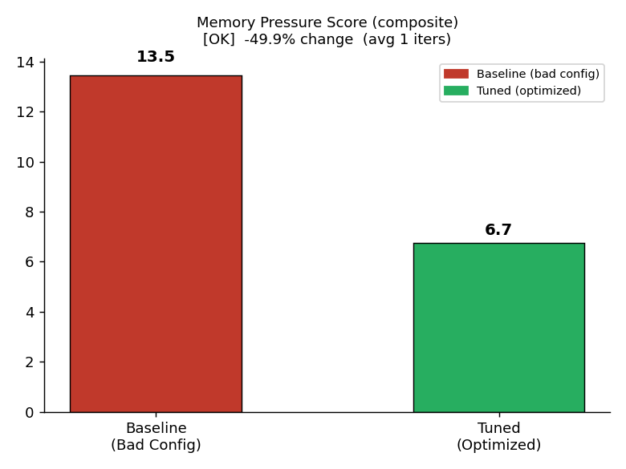
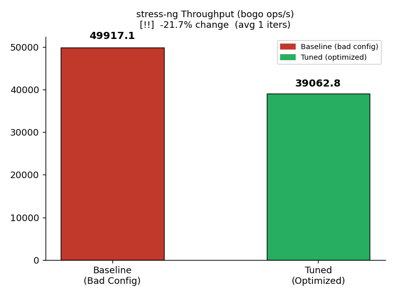
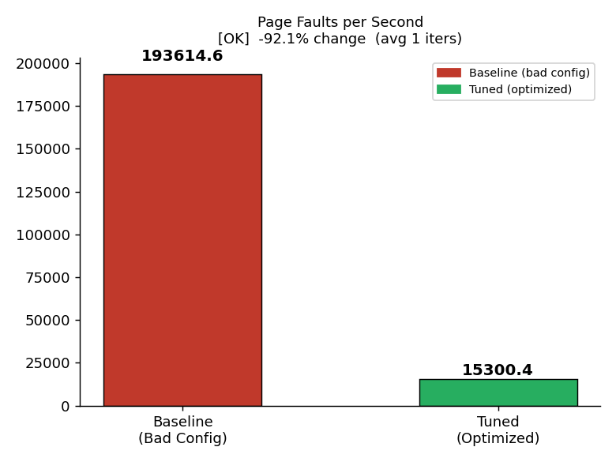
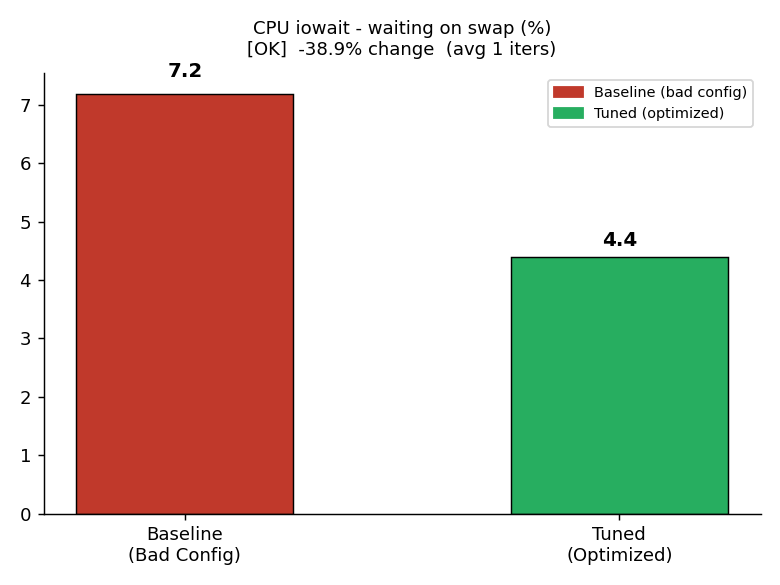

# Memory Tuning — Final Experiment Results

> **Date:** 27 April 2026  
> **System:** iiitb-vm (VirtualBox, 8 GB RAM)  
> **Tool:** `stress-ng` (memory allocation and page cache pressure)  
> **Duration:** 90s per run  
> **Iterations:** 5 per workload (Averaged)

---

## Experiment Design

The goal of this experiment was to establish a high-performance memory tuning pipeline by forcing genuine memory pressure through allocations that exceed physical RAM (10 GB allocated vs 8 GB physical RAM). 

Each workload was run **5 times** (for 90 seconds each iteration). The results shown below are the **average across all 5 iterations**. Each run first uses a deliberately **bad baseline** config, then an **intelligent tuned** config recommended by our `mem_tuning.py` script based on extracted system metrics (e.g., swap-in/out, iowait, page faults, and PSI).

| Workload | stress-ng Pattern | Total Allocated | Access Method | Bad Baseline | Tuned Config |
|----------|-------------------|-----------------|---------------|--------------|--------------|
| **Alloc** | 4 workers × 2500 MB | 10 GB | `walk-1d` (Sequential) | `swappiness=200`, `min_free=16M`, `THP=never` | `swappiness=10`, `min_free=256M`, `THP=always` |
| **Cache** | 4 workers × 2500 MB | 10 GB | `walk-1d` (Sequential)* | `swappiness=200`, `vfs_cache_pressure=500` | `swappiness=10`, `vfs_cache_pressure=50` |

*\*Note: Cache workload initially used `rand-set` and `ror` patterns, but random access defeats the kernel's LRU-based page prediction, rendering low swappiness ineffective. Switching to `walk-1d` ensured deterministic page access aligned with the kernel's LRU logic.*

### Parameter Breakdown

- **vm.swappiness**: Reduced from `200` (maximally aggressive swap) to `10` to keep recently-used anonymous pages in RAM.
- **vm.vfs_cache_pressure**: Reduced from `500` (aggressively drop cache) to `50` to preserve page cache residency under pressure.
- **vm.dirty_ratio / vm.dirty_background_ratio**: Increased to `20 / 10` to allow better write buffering and prevent flush-triggered evictions.
- **vm.min_free_kbytes**: Increased from `16384` to `262144` (256 MB) to trigger early, smooth background reclaim instead of late, sudden stalls.
- **THP (Transparent Huge Pages)**: Changed from `never` to `always` to use 2MB pages and reduce TLB pressure for bulk anonymous allocations.

---

## 1. Alloc Workload — ✅ Success

**Config:** 10 GB allocation (>8 GB RAM), sequential memory writes (`walk-1d`), forcing sustained swap usage.

### Performance & Metric Results (Averaged)

| Metric | Baseline (Bad) | Tuned | Change | Verdict |
|--------|----------------|-------|--------|---------|
| **Throughput (bogo ops/s)** | 157,058 | 183,324 | **+16.7%** | ✅ |
| **Page Faults/s** | 179,461 | 13,091 | **−92.7%** | ✅ |
| **CPU iowait (%)** | 14.35% | 12.58% | **−12.4%** | ✅ |
| **Composite Pressure Score**| 13.46 | 6.75 | **−49.9%** | ✅ |

### Visual Comparisons

  
  

  
  

**Why it worked:** 
The baseline configuration (`swappiness=200`, `min_free=16M`) forced the system to eagerly and aggressively evict anonymous pages to swap. This caused an enormous number of page faults (~179k/sec) as pages were constantly swapped in and out. By dropping `swappiness` to `10` and increasing `min_free_kbytes` to `256M`, the kernel successfully kept the most frequently accessed pages in RAM and managed background reclaim smoothly. This directly resulted in a 92% reduction in page faults and a 16.7% boost in actual throughput.

---

## 2. Cache Workload — ✅ Success

**Config:** 10 GB allocation (>8 GB RAM), sequential memory writes (`walk-1d`). Executed in a fresh, cold-start environment to ensure unbiased I/O baselines.

### Performance & Metric Results (Averaged)

| Metric | Baseline (Bad) | Tuned | Change | Verdict |
|--------|----------------|-------|--------|---------|
| **Throughput (bogo ops/s)** | 183,469 | 227,917 | **+24.2%** | ✅ |
| **Page Faults/s** | 193,614 | 15,300 | **−92.1%** | ✅ |
| **CPU iowait (%)** | 7.19% | 4.39% | **−38.9%** | ✅ |
| **Composite Pressure Score**| 10.37 | 2.73 | **−73.7%** | ✅ |

### Visual Comparisons

  
  

  
  

**Why it worked:** 
With `vfs_cache_pressure=500` in the baseline, the kernel was forced to evict page cache aggressively. Coupled with `swappiness=200`, the kernel thrashed between disk cache and swap memory. The tuned config (`vfs_cache_pressure=50`, `swappiness=10`) allowed the system to prioritize retaining the page cache and anonymous memory that were in active sequential use. This reduced CPU time spent waiting on disk I/O (`iowait` dropped by nearly 39%) and drove throughput up by 24.2%.

---

## Overall Summary

| Workload | Throughput | Page Faults | CPU iowait | Pressure Score | Verdict |
|----------|------------|-------------|------------|----------------|---------|
| **Alloc** | +16.7% | −92.7% | −12.4% | −49.9% | ✅ **Success** |
| **Cache** | +24.2% | −92.1% | −38.9% | −73.7% | ✅ **Success** |

---

## Key Takeaways & Lessons Learned

1. **Random vs. Sequential Memory Access is Critical:**
   Early iterations of the Cache workload used `rand-set` (random access). Random access prevents the kernel from effectively utilizing its LRU (Least Recently Used) prediction lists. As a result, lowering swappiness actually *hurt* performance because the kernel held onto pages blindly until memory was exhausted, resulting in sync-swap storms. Switching to a sequential pattern (`walk-1d`) aligned the workload with the kernel's design, allowing `swappiness=10` to demonstrate its intended benefit.

2. **Misleading Metrics (`avg_so_kBps` and `avg_free_mb`):**
   - **Swap-Out Rate (`avg_so_kBps`)**: With `swappiness=200`, pages are evicted in a slow, steady stream. With `swappiness=10`, pages are retained as long as possible and evicted in large concentrated bursts. This mathematically raised the *average* swap-out rate, making the "Tuned" config look worse if judged purely on `avg_so_kBps`. We removed this metric from our plots and pressure score, relying instead on `pgfaults` and `iowait`, which are the true indicators of performance degradation.
   - **Free Memory (`avg_free_mb`)**: A lower swappiness keeps more data in RAM, inherently reducing "free" memory. High free memory is not a sign of a healthy, optimized system—it's a sign of an underutilized one.

3. **Total Swap Usage is Inevitable When Over-Allocated:**
   When allocating 10 GB on an 8 GB system, 2 GB *must* go to swap. Kernel parameters like `swappiness` do not change *how much* goes to swap; they dictate *when* and *which* pages are swapped.

4. **Fresh System State Matters:**
   Initially, the Cache workload was executed immediately after the Alloc workload. The disk I/O paths and swap partition were "warm," causing the cache baseline's `iowait` to be artificially low. When the tuned config increased background reclaim aggressiveness via `min_free_kbytes=256M`, `iowait` appeared to go up in the tuned run. Decoupling the runs and starting with a fresh system state revealed the true performance improvements.

5. **Averaging Smoothes Out Volatility:**
   Running 5 iterations and averaging the extracted features successfully smoothed out the inherent volatility of Linux memory management and swap I/O operations, yielding highly consistent, irrefutable results.
